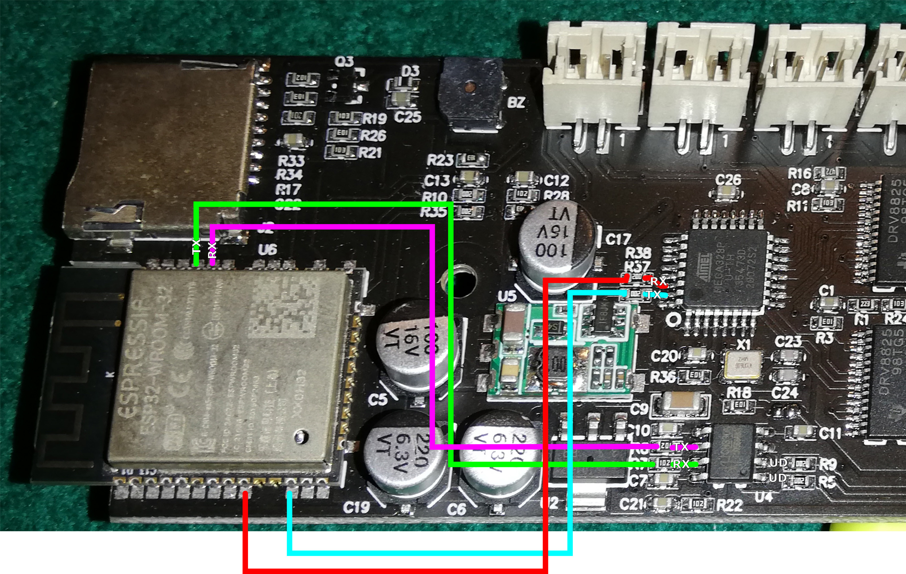
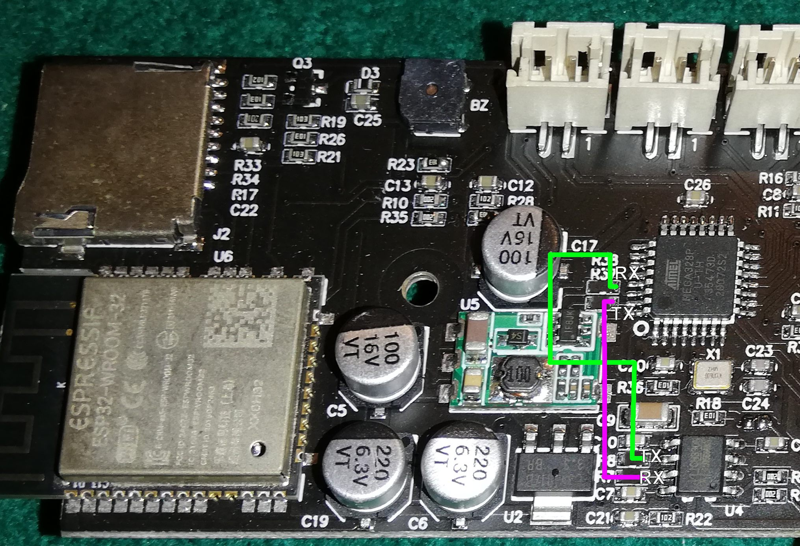

# Transform VG-L7x controller to a standard Grbl board
If you need to use VG-L7x engraver with any standard GRBL compatible software you can try with this hack (at your risk).

Here is a picture of a VG-L7x board that highlight connection between USB - CH330 - ESP32 - Atmega328:

If you bypass the ESP32 WiFi chip, connecting directly the Atmega328 with the USB-Serial CH330 converter chip, and removing connection between ESP32 and Atmega328, you should be able to use VG-L7x board as a standard GRBL compatible board.

You should carefully remove the smd resistor R7, R8, R37, R38 and solder a small wire between the resistor pad, side near CH330, and the resistor pad near Atmega 328. TX to RX, and RX to TX.

WARNING: this entails the loss of the warranty and the disabling of all WiFi functions. The board will only continue to work via USB.
